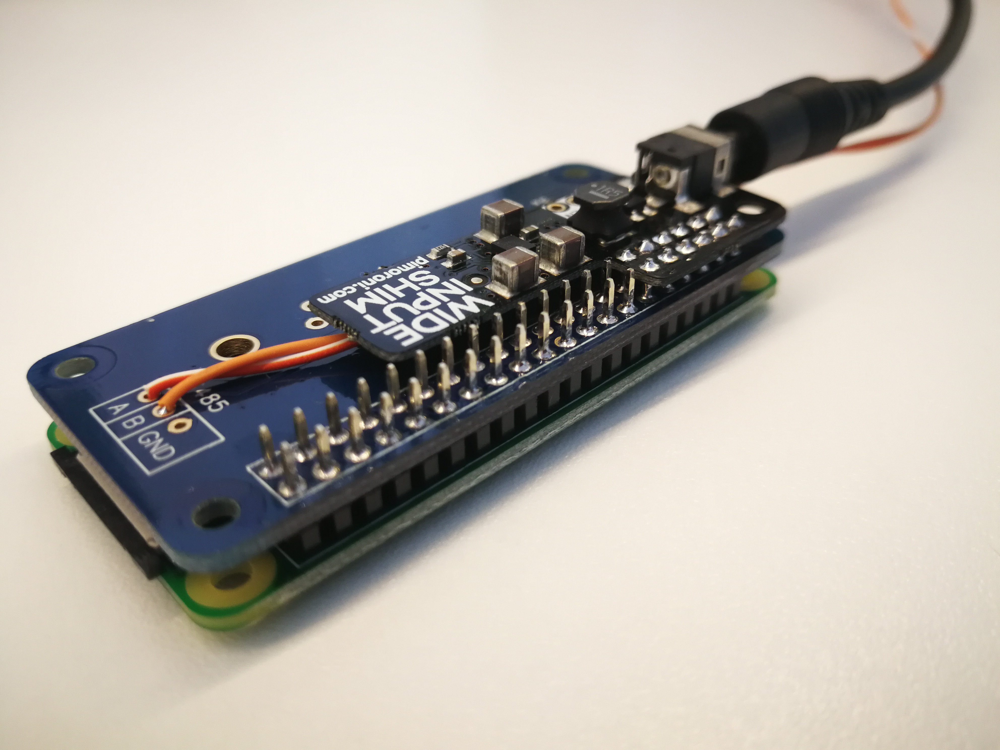
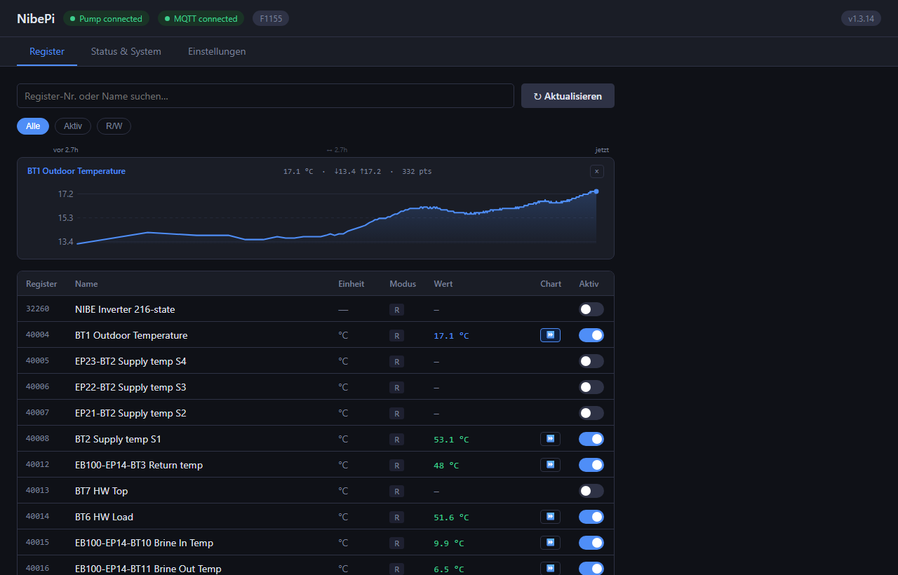
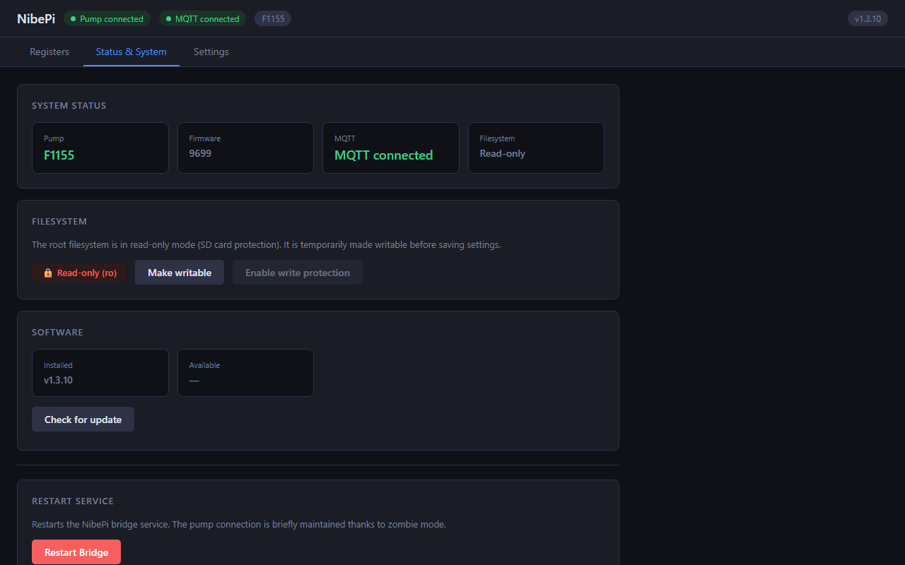
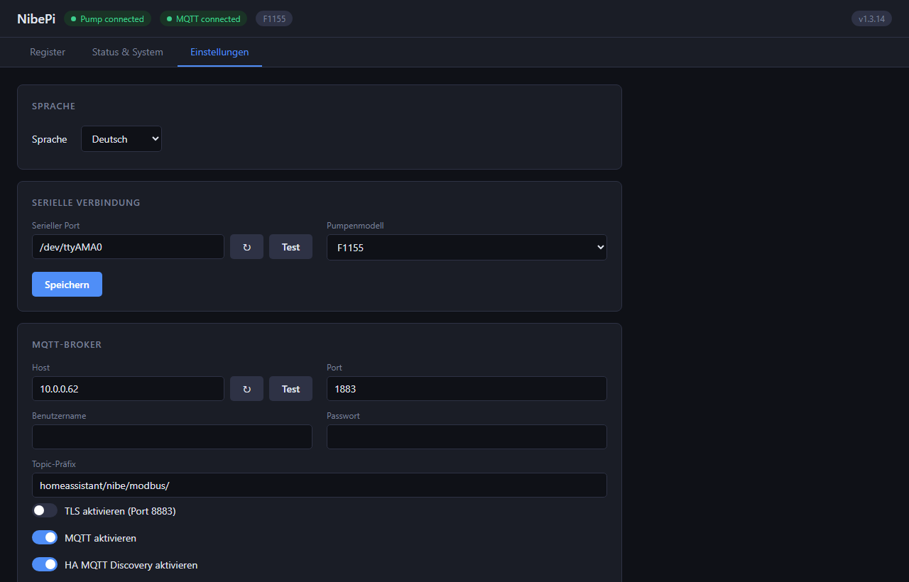
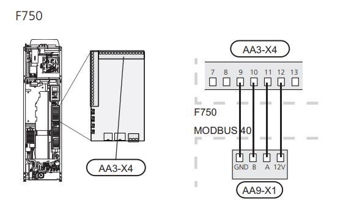
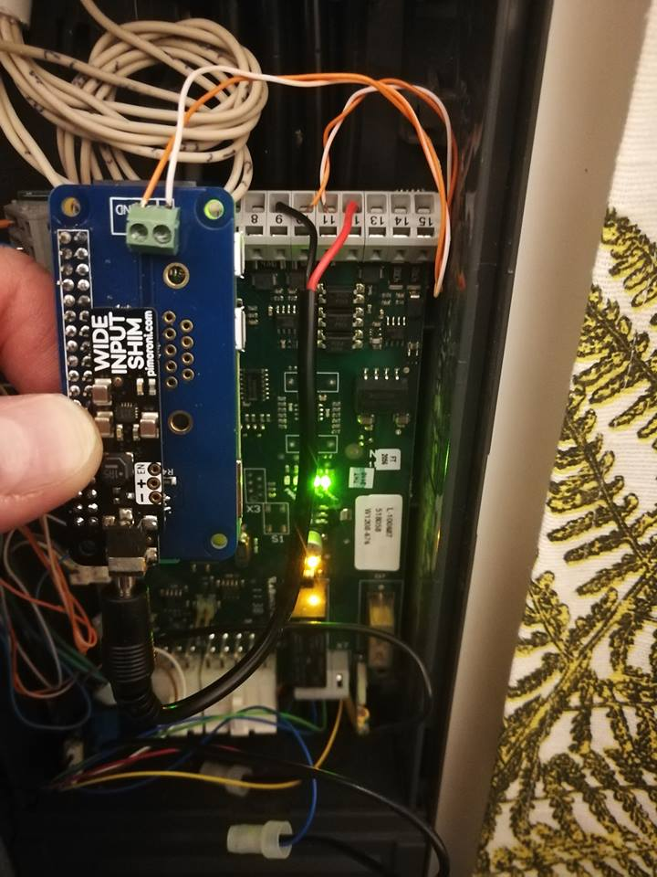

#  NibePi

A standalone bridge that connects a NIBE heat pump to Home Assistant via MQTT. Runs on a Raspberry Pi Zero W fitted with an RS485 HAT inside the heat pump casing. No Node-RED, no cloud — ~150 MB less RAM used compared to the original project.



> Fork of [anerdins/nibepi](https://github.com/anerdins/nibepi). Licensed under MIT.

---

## What this fork adds

The original project used Node-RED and a custom Pi image. This fork replaces all of that with a single Node.js daemon and a built-in browser UI:

- **No Node-RED** — ~150 MB less RAM, no flow editor, no third-party runtime
- **Browser config UI** — dark-themed, responsive, served directly from bridge.js on port 1880
- **19 UI languages** — English, German, French, Spanish, Italian, Dutch, Portuguese, Swedish, Norwegian, Danish, Finnish, Polish, Czech, Slovak, Slovenian, Croatian, Romanian, Hungarian, Greek
- **Home Assistant MQTT Discovery** — sensors, numbers, switches, and selects created automatically
- **Register history charts** — up to 360 data points per register with adaptive downsampling; hover or tap to show a crosshair and tooltip with exact value and age
- **Register write from UI** — R/W registers show an inline editor with type-appropriate controls: dropdown for state maps, validated number input with unit label and min/max from the pump model
- **OTA updates** — check for and install new releases directly from the Status tab
- **Alarm display & history** — active alarm shown in header and status panel; full history of up to 50 past alarms in Status tab
- **Config backup/restore** — export config.json with one click; restore by uploading a previously exported file
- **MQTT TLS** — optional encrypted connection to the broker (port 8883); custom CA cert path supported
- **Web UI authentication** — optional HTTP Basic Auth; set your own username and password in Settings → Authentication before enabling
- **Live log streaming** — tail the bridge log in real time from the browser
- **Memory usage chart** — bridge + backend RSS sampled hourly, displayed as a 2-week sparkline with hover tooltip
- **SD card protection** — read-only root filesystem with tmpfs for `/tmp` and `/var/log`; remounts rw only when saving settings
- **Graceful restarts** — zombie mode keeps the pump connected during service restarts and OTA updates
- **Hardware watchdog** — Pi auto-reboots if the bridge hangs
- **Network watchdog** — recovers `wlan0` if WiFi drops, so the Pi cannot quietly vanish from the network

---

## Screenshots

| Registers | Status & System | Settings |
|---|---|---|
|  |  |  |

---

## How it works

```
Heat pump  ←→  RS485 HAT  ←→  Raspberry Pi Zero W
                                      │
                               bridge.js (Node.js)
                               ├── backend.js (serial/Modbus child process)
                               ├── MQTT → Home Assistant
                               └── HTTP config UI  :1880
```

`bridge.js` is a single Node.js daemon. It forks `backend.js` to own the RS485 serial port, decodes NIBE F-series Modbus frames, publishes register values to MQTT, and serves a browser-based config UI. Home Assistant auto-discovers all configured sensors, numbers, switches, and selects via MQTT discovery.

---

## Supported pump models

F370, F470, F730, F750, F1145, F1155, F1245, F1255, F1345, F1355,
VVM225, VVM310, VVM320, VVM325, VVM500, SMO20, SMO40, RMU40 (S1–S4), S1255

---

## Hardware

### What you need

| Part | Example suppliers |
|---|---|
| Raspberry Pi Zero W | [thepihut.com](https://thepihut.com/products/raspberry-pi-zero-w) · [kiwi-electronics.nl](https://www.kiwi-electronics.nl/raspberry-pi-zero-w) |
| RS485 HAT | [thepihut.com](https://thepihut.com/products/rs485-pizero?variant=26469099976) · [kiwi-electronics.nl](https://www.kiwi-electronics.nl/rs-485-pi) · [abelectronics.co.uk](https://www.abelectronics.co.uk/p/77/rs485-pi) |
| 12V wide-input power HAT | [thepihut.com](https://thepihut.com/products/wide-input-shim) · [kiwi-electronics.nl](https://www.kiwi-electronics.nl/wide-input-shim) |
| 16 GB microSD card | any brand |
| Micro-USB cable + power supply (for initial setup only) | |

### Assembly

Solder screw terminals on the A and B pads of the RS485 HAT. Stack the boards: Pi Zero W → 12V HAT → RS485 HAT, as flat as possible to fit inside the pump casing.

### Installing inside the pump

1. Remove the upper filter hatch (exhaust models only).
2. Unscrew the two large Torx T30 screws at the bottom of the front panel, tilt it out and lift it off.
3. Remove the snap-in cover inside the pump.



4. Connect NibePi to the 12V, A, B and GND terminals. Connections vary by model — consult your manual or [this NIBE wiring guide](https://www.nibe.fi/nibedocuments/15050/031725-6.pdf).



| NibePi terminal | Pump terminal |
|---|---|
| 12V | 12V (or GND-referenced supply rail) |
| GND | GND |
| A | RS485 A |
| B | RS485 B |

5. Insert the SD card and power on the pump with the front panel removed.

---

## Raspberry Pi setup

No custom image needed — start from a standard **Raspberry Pi OS Lite** image.

### 1. Flash the OS

Download [Raspberry Pi Imager](https://www.raspberrypi.com/software/) and flash **Raspberry Pi OS Lite (32-bit)** to a 16 GB SD card.

Before writing, click the ⚙ settings icon and configure:

| Setting | Value |
|---|---|
| Hostname | `nibepi` |
| Enable SSH | ✓ (password authentication) |
| Username | `pi` |
| Password | your choice |
| WiFi SSID / password | your network |
| WiFi country | your country code |

Use Imager's customisation rather than dropping a `wpa_supplicant.conf` on the boot
partition — that is the Bullseye-era mechanism, and on Bookworm/Trixie the network is
managed by NetworkManager, which Imager configures correctly.

Tested on **Raspbian 13 (Trixie)** on a Pi Zero W. `setup.sh` and `harden.sh` detect
whether the boot partition is at `/boot` (Bullseye) or `/boot/firmware` (Bookworm and
later), and whether the network is run by NetworkManager or `dhcpcd`/`wpa_supplicant`,
so both generations work.

### 2. Run the setup script

Insert the card, power on the Pi, and SSH in once it appears on the network:

```bash
ssh pi@nibepi
bash <(wget -qO- https://raw.githubusercontent.com/JustChr/nibepi/master/setup.sh)
```

The script handles everything automatically:
- Expands the filesystem to the full card
- Configures the hardware UART for RS485 (disables serial console, frees UART from Bluetooth)
- Sets hostname to `nibepi` if not already set
- Installs Node.js 22 for ARMv6l (v22 is the newest Node built for ARMv6 — 24 and later are not, so this is the ceiling on a Zero W)
- Downloads the latest NibePi release from GitHub
- Installs npm dependencies (compiles serialport, ~6 min)
- Installs and enables the systemd service
- Applies hardening (read-only root, tmpfs, watchdog, network watchdog, Bluetooth disabled)
- Reboots if any boot-level changes were made

Total time: ~10 minutes, no further input required.

### 3. Enable Modbus on the pump

1. Hold the **Back** button for ~7 seconds to open the service menu.
2. Navigate to **System Settings 5.2**.
3. Scroll down and enable **Modbus**.
4. The pump may show a brief red alarm while NibePi finishes booting — this is normal.

### 4. Open the config UI

```
http://nibepi:1880
```

On a fresh install with no existing config, the bridge automatically opens a 5-step setup wizard.

---

## Hardening the Pi

Hardening is applied automatically by `setup.sh`. To re-apply manually:

```bash
sudo mount -o remount,rw /
bash <(wget -qO- https://raw.githubusercontent.com/JustChr/nibepi/master/patches/harden.sh)
sudo reboot
```

### What it does

| Change | Why |
|---|---|
| Root filesystem `ro` in fstab | Boots read-only every time — the single biggest protection for the SD card |
| `/tmp` and `/var/log` → tmpfs (RAM) | Eliminates the most common sources of runtime SD writes |
| Hardware watchdog enabled (`dtparam=watchdog=on`) | Pi reboots automatically if the kernel hangs or freezes |
| systemd watchdog timers (1 min / 2 min), set via a `system.conf.d` drop-in | systemd kicks the watchdog; if it stops, the hardware watchdog fires |
| Bluetooth disabled (`dtoverlay=disable-bt`) | Unused on this device; frees a CPU core and reduces background activity |
| Bridge service restart limits | After 5 crashes within 2 minutes, triggers a full reboot instead of looping |
| WiFi power save disabled | `brcmfmac` enables it by default and is prone to dropping the association for good |
| Network watchdog (every 60 s) | `wlan0` is the Zero W's only link; the hardware watchdog cannot see it die |
| `resolv.conf` → `/run` symlink | a read-only root blocks NetworkManager from writing it, silently killing all DNS |
| Time sync | `fake-hwclock` can't save on a read-only root, so every boot starts from a stale clock |

bridge.js remounts rw temporarily only when saving config, then returns to ro immediately after.

### Network watchdog

The hardware watchdog only catches a *hung* kernel. If `wlan0` silently drops its
association the kernel stays perfectly healthy — systemd keeps kicking the watchdog,
the RS485 loop keeps the heat pump happy, and the Pi just quietly disappears from the
network until someone power-cycles it.

`netwatch.sh` pings the default gateway once a minute and escalates only as far as it
has to:

| After | Action |
|---|---|
| 3 min | Re-assert power save off, `wpa_cli reassociate`, renew DHCP |
| 6 min | Bounce `wlan0`, restart `wpa_supplicant`, renew DHCP |
| 10 min | Reload the `brcmfmac` module |
| 15 min | Reboot — **at most once per 6 hours** |

The reboot is rate-limited on purpose: it interrupts RS485 for ~30 s and cannot fix an
upstream fault (router down, power cut). If a reboot did not help, staying up and
serving the heat pump beats looping.

Events are appended to **`/boot/nibepi-netwatch.log`** — with association state, BSSID
and signal level at the moment of failure. `/var/log` is tmpfs, so it is wiped by the
very reboot that fixes the problem; `/boot` is a separate rw vfat mount that survives,
and is only written on real incidents, so it costs nothing in SD wear.

### DNS on a read-only root

Worth knowing about, because the symptom is confusing. NetworkManager rewrites
`/etc/resolv.conf` whenever the link comes up, and a read-only root blocks that
**silently** — you end up with a `resolv.conf` holding comments and no nameserver.

Nothing obviously breaks: the link is up, ping by IP works, and MQTT keeps flowing
because the broker is configured as a literal address. But every hostname lookup fails,
so time sync never resolves a pool server and update checks cannot reach GitHub.

`harden.sh` symlinks `/etc/resolv.conf` to NetworkManager's runtime copy under `/run`
(tmpfs), which it can always write.

### Time sync

`fake-hwclock` cannot write its saved timestamp while the root filesystem is read-only,
so the Pi boots with a stale clock every time and something has to correct it. This is
not cosmetic: the clock stamps the netwatch incident log, the only forensic record that
survives a reboot.

On Trixie, `systemd-timesyncd` handles it and `harden.sh` leaves it alone — but note it
is useless until DNS works, which is why the `resolv.conf` fix above matters.

On older images `harden.sh` installs `timesync.sh`, which runs `sntp -S` at boot and
hourly, preferring the LAN gateway (it answers even when the WAN is down) and falling
back to `pool.ntp.org`. That fallback exists because `ntpd` proved unreliable: it
listened correctly and had `-g`, yet never established a single pool association
(`reach 0` on every peer), leaving the clock 23 minutes out — and it refuses to step
offsets beyond 1000 s regardless. `sntp -S` steps no matter how large the offset.

---

## Configuration

All configuration is done through the browser UI at `http://nibepi:1880`. Settings are saved to `/etc/nibepi/config.json`.

### Connection tab

| Setting | Description |
|---|---|
| Serial port | RS485 device node, default `/dev/ttyAMA0` |
| Pump series | F-series (all supported models use this) |

The pump model is detected automatically on first connection and saved to config.

### MQTT tab

| Setting | Description |
|---|---|
| Host | IP or hostname of your MQTT broker |
| Port | Default `1883` |
| Username / Password | Optional broker credentials |
| Topic prefix | Base topic for all register values, default `nibe/modbus/` |
| HA Discovery | Enable to auto-publish Home Assistant MQTT discovery messages |

### Register tab

Browse or search all registers for your pump model. Toggle individual registers on to start polling them. Active registers are polled continuously and their live values are shown in the table.

Click the chart button (📊) on any active register to open a history sparkline. The chart keeps up to 360 samples with adaptive downsampling — recent data at 10 s resolution, older data thinned proportionally. Hover or tap anywhere on the chart to show a crosshair and tooltip with the exact value and sample age.

R/W registers have an edit button. The editor adapts to the register type:
- State map registers show a **dropdown** with labelled options
- Numeric registers show a **number input** with the unit appended, pre-filled min/max bounds from the pump model, and inline validation

### Status & System tab

| Control | Description |
|---|---|
| System Status | Pump model, firmware version, MQTT state, filesystem mode |
| Alarm history | Up to 50 past alarms with start and end timestamps |
| Memory chart | Bridge + backend RSS sampled hourly, last 2 weeks; hover or tap to inspect individual samples |
| Filesystem mode | Toggle root filesystem between read-only (normal) and read-write (for manual edits) |
| Log / Debug | Enable verbose logging and raw Modbus frame output |
| Restart | Restart the bridge service (graceful zombie handover — pump stays connected) |
| Software | Check for updates and install new releases OTA |
| Config | Export config to file or restore from a backup |
| Live log | Streams the last 500 log lines in real time |

---

## Home Assistant integration

With **HA Discovery** enabled, every active register is automatically published to Home Assistant as a MQTT entity under the device **"Nibe Heat Pump"**:

| Register type | HA entity type |
|---|---|
| Read-only, numeric | `sensor` |
| Read-only, state map (e.g. operating mode) | `sensor` with `value_template` |
| Read/write, numeric | `number` |
| Read/write, binary state map (0/1) | `switch` |
| Read/write, multi-state map | `select` |

Discovery messages are published with `retain: true` and re-published automatically after MQTT broker restart.

MQTT topics follow the pattern:

```
nibe/modbus/<register>        ← current value (published on every update)
nibe/modbus/<register>/set    ← write a value (R/W registers only)
nibe/modbus/<register>/raw    ← raw scaled value
```

---

## First-time setup wizard

On a fresh install (no existing `/etc/nibepi/config.json`), the bridge automatically redirects to a 5-step setup wizard at `http://nibepi:1880/setup`:

1. **Language** — pick the UI language
2. **Serial Connection** — select the RS485 port and optionally the pump model
3. **MQTT** — configure the broker (or skip for later)
4. **Authentication** — optionally set a username and password
5. **Review & Finish** — save and redirect to the main UI

Existing installs that already have a config file skip the wizard entirely.

---

## Authentication

Web UI authentication is **disabled by default**. To enable it:

1. Open the UI → **Settings** → **Authentication**
2. Enter your desired **username** and **password**
3. Toggle **Enable Authentication** on and click **Save**

From that point on, every browser connecting to port 1880 will get a native HTTP Basic Auth prompt. To disable it again, uncheck the toggle and save.

> **Tip:** If you lock yourself out (forgot the password), SSH into the Pi and edit `/etc/nibepi/config.json` — set `"auth": { "enable": false }` and restart the bridge.

---

## Deploying updates

Use the **Software** card in the Status & System tab of the UI — click "Check for update", then "Install" if a newer version is available. The bridge restarts automatically and the pump stays connected during the handover.

To update manually from the Pi:

```bash
bash <(wget -qO- https://raw.githubusercontent.com/JustChr/nibepi/master/setup.sh)
```

Restart is graceful: `backend.js` enters zombie mode to keep the pump connected, and the new instance claims the serial port via SIGUSR2 within a few seconds.

---

## Migrating from the original Node-RED setup

If you are running the original anerdins/nibepi image with Node-RED, run the setup script — it will install bridge.js alongside Node-RED without touching it. Then cut over with zero pump downtime:

```bash
# Stop Node-RED — backend.js enters zombie mode, pump keeps getting ACKs
sudo systemctl stop nodered

# Start bridge — it claims the serial port from the zombie (3–9 s)
sudo systemctl start bridge

# Verify
sudo systemctl status bridge
journalctl -u bridge -f

# Disable Node-RED autostart
sudo systemctl disable nodered
```

---

## Troubleshooting

**Bridge doesn't start / exits immediately**

```bash
journalctl -u bridge -n 50
```

Check that `/usr/local/bin/node` exists and is v18:
```bash
/usr/local/bin/node --version
```

**Serial port busy on startup**

If the previous backend.js left a stale PID file:
```bash
rm -f /dev/shm/nibepi_backend.pid /tmp/nibepi_backend.pid
sudo systemctl restart bridge
```

**Pump shows communication alarm after restart**

The `KillMode=process` in `bridge.service` is required. Verify:
```bash
grep KillMode /etc/systemd/system/bridge.service
# should print: KillMode=process
```

**MQTT not connecting**

Check broker host/port in the UI. Verify the broker is reachable from the Pi:
```bash
nc -zv <mqtt-host> 1883
```

**Register values not appearing in Home Assistant**

Make sure **HA Discovery** is enabled in the MQTT tab and the register is toggled on in the Register tab. Check Home Assistant → Settings → Devices & Services → MQTT.

---

## Credits

Fork maintained by [Chris Krammer](https://github.com/JustChr). Licensed under MIT.

Based on the original [anerdins/nibepi](https://github.com/anerdins/nibepi) by Fredrik Anerdin.
